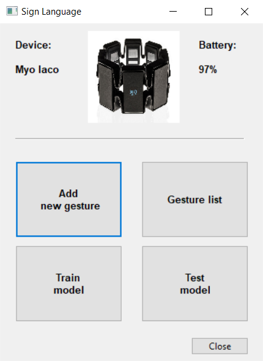
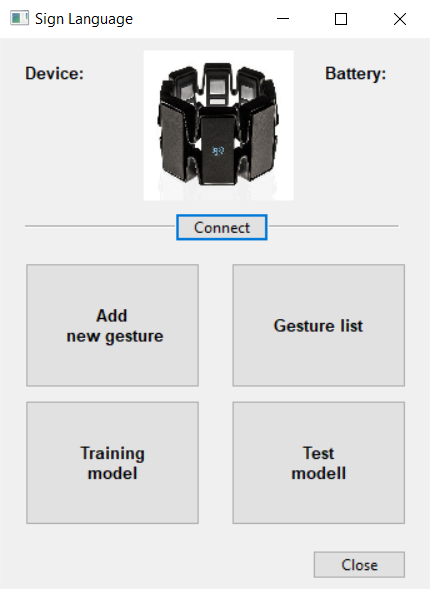
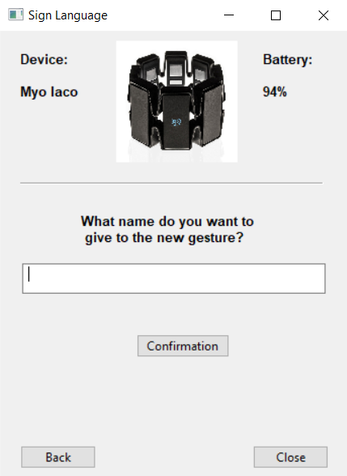
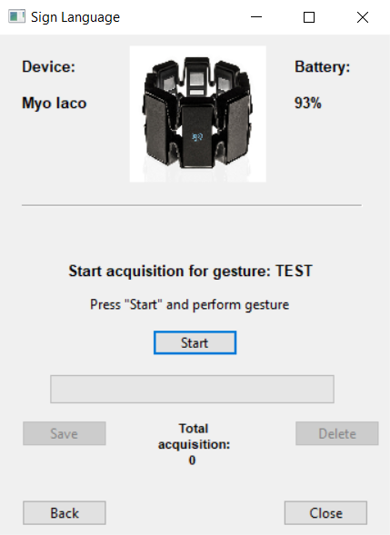
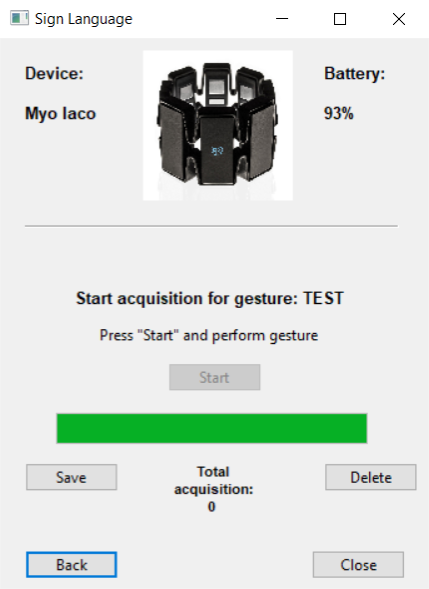
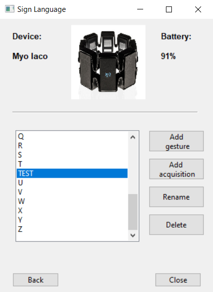
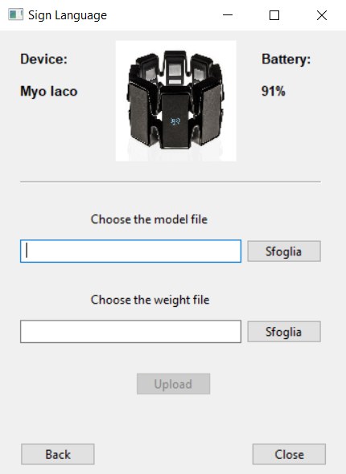
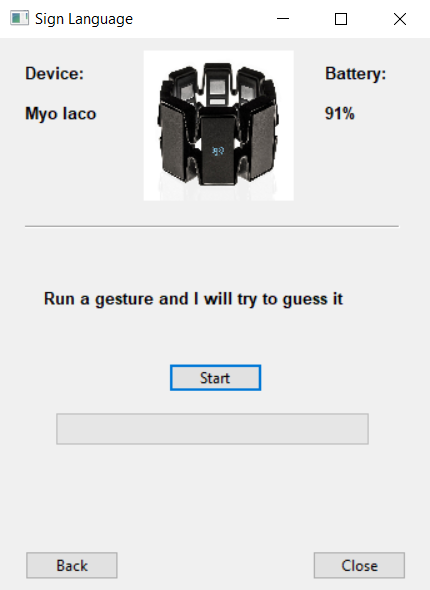
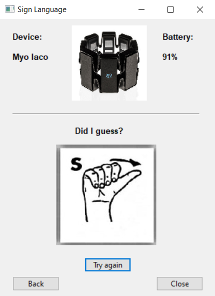

# An EMG and IMU Dataset for the Italian Sign Language Alphabet 

This repository contains surface EMG and IMU data collected with the Myo Gesture Control Armband about the gestures of the 26 letters of the Italian Sign Language Alphabet.

## Data Description

The dataset contains 780 gesture samples (30 for each letter of the alphabet) and is organized into 26 directories, one for each letter of the alphabet. Each directory includes 30 json files, one for each sample of the gesture representing a letter. Each json file is named using a Global Unique Identifier (GUID) and is organized as a json object as follows

	 JSON
 	  ├─ timestamp (string)
	  ├─ duration (integer)
	  ├─ emg (object)
	  │   ├─ frequency (integer)
	  │   └─ data (integer matrix, dimensions: 400 x 8)
	  └─ imu (object)
	      ├─ frequency (integer)
	      └─ data (object array, length: 400)
	          ├─ gyroscope (floating point array, length: 3)
	          ├─ acceleration (floating point array, length: 3)
	          └─ orientation (floating point array, length: 4)

The following fields are available:
-  *timestamp*, a string representing the date and time of the gesture acquisition. For example, the string “09/07/20/10:03:19” suggests that the gesture and its acquisition were performed the 9th of July 2020, at 10:03:19 a.m.
-  *duration*, an integer describing how long was the data acquisition of the gesture in milliseconds. The value is 2000 in all the json files, since the time window for the data acquisition was 2 seconds;
-  *emg*, an object representing the EMG data of the gesture. It has two fields
    -  *frequency*, i.e. the sampling frequency (in Hz) of the values from the EMG sensors. This value is 200 in all the json files;
    -  *data*, a 400 x 8 integer matrix. Each row is then an 8-dimensional array including the values from the 8 EMG sensors of the Myo Armband. Therefore, data is the time series of the values from the EMG sensors during the acquisition of the gesture;
-  *imu*, an object representing the IMU data of the gesture acquisition. It has two fields
    -  *frequency*, i.e. the sampling frequency (in Hz) of the values from the IMU. This value is 200 in all the json files;
    -  *data*, a 400 elements length object array. Each object has three fields, namely *gyroscope* (an array composed by 3 floating point values), *acceleration* (an array composed by 3 floating point values), and *rotation* (an array composed by 4 floating point values).

## Dataset Release Agreement

The dataset is freely released for research and educational purposes. Please cite as
- I. Pacifici, P. Sernani, N. Falcionelli, S. Tomassini, A. F. Dragoni, A surface electromyography and inertial measurement unit dataset for the italian sign language alphabet, Data in Brief 33 (2020). doi:10.1016/j.dib.2020.106455.
	 
Bibtex entry:

	 @article{Pacifici2020,
	  title = "A surface electromyography and inertial measurement unit dataset for the Italian Sign Language alphabet",
	  journal = "Data in Brief",
	  volume = "33",
	  eid = "106455",
	  year = "2020",
	  doi = "10.1016/j.dib.2020.106455",
	  author = "Iacopo Pacifici and Paolo Sernani and Nicola Falcionelli and Selene Tomassini and Aldo Franco Dragoni",
	 }

The paper is open access and available here <https://www.sciencedirect.com/science/article/pii/S2352340920313378>.

## Data Acquisition App

The data were collected with a data acquisition app developed for this specific purpose. The app runs in Python 3.X. The source code is available in app.py.

### Configuration

To run the app some preliminary steps are required:

1. Download and install Python 3.X (<https://www.python.org/downloads/>) and get the pip library `$ python get-pip.py`
2. Download and install the Myo Connect application and Myo SDK (<https://support.getmyo.com/hc/en-us/articles/360018409792-Myo-Connect-SDK-and-firmware-downloads>)
3. Add the Myo SDK bin folder to the system PATH
4. Install the Python bindings for the Myo SDK by running
 `$ pip install myo-python`
5. Install numpy, wxPython, keras, tensorflow and psutil modules
 `$ pip install numpy wxPython keras tensorflow psutil`

### Usage

1. Before running the gesture acquisition app, connect the Myo Armband to your PC and run the Myo Connect app. Note that on the very first connection you need to synchronize and calibrate the device, following a wizard. On subsequent connections, only a fast synchronization is needed (until the Myo Armband vibrates).

2. Once the Myo Armband is connected, run `$ python app.py`

The app main menu is organized into four functions:
1. [Add new gesture](#add-new-gesture)
2. [Gesture list](#gesture-list)
3. [Train model](#train-model)
4. [Test model](#test-model)

  

In case the app is launched without a connected Myo Armband, an alert message warns the user, and the connection can be started from the app itself.

  

#### Add new gesture

Once "Add new gesture" is clicked, a form asks for a new gesture name. This will create a directory with the gesture name (upper case) in the "Dataset" directory.

  

Then, a gesture acquisition can be started. The time window of the acquisition (2 seconds) is highlighted by a progress bar. At the end of the acquisition, the gesture sample can be saved or deleted, and a new acquisition can be started.

  

  

#### Gesture list

Selecting "Gesture list" in the app menu allows to check the list of the available gestures, i.e. the directories which compose the dataset. In gesture list:
- a new gesture can be created (exactly as in the "Add new gesture" function), by clicking "Add gesture";
- a new gesture acquisition can be added to an existing gesture directory, by selecting a gesture and then clicking "Add acquisition";
- a gesture (and therefore its directory) can be renamed, by selecting it and clicking "Rename";
- a gesture (and therefore its directory) can be removed, by selecting it and clicking "Delete";

  

#### Train model

Since this app is part of a gesture recognition project, we plan to add here the chance to train a model with the samples of the dataset. However, this functionality has not been implemented yet. Therefore, in the current version of the app, clicking "Train model" has no effects.

#### Test model

Since this app is part of a gesture recognition project, we added this functionality to test gesture recognition models built in Keras (2.4) with Tensorflow (2.x) as the backend. Once "Test model" is clicked, a model file and a weight file to be tested can be selected. Uploading them results in an acquisition form where the gesture can be performed and then classified by the model.

  

  

  

